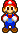

#  Mario Parkour

**Mario Parkour** — это увлекательная платформер-аркада, где вы управляете персонажем, который прыгает по платформам, собирает монетки и избегает врагов. Игра сочетает в себе динамичный геймплей, красочную графику и захватывающую механику прыжков.

---

## Особенности игры

- 🎮 **Динамичный геймплей**: Управляйте персонажем, прыгайте по платформам и избегайте опасностей.
- 🌥️ **Красивый фон с облаками**: Бесконечный параллакс-фон создает ощущение глубины и движения.
- 🟡 **Сбор монеток**: Собирайте монетки, чтобы увеличить свой счет.
- 🏁 **Прогрессия**: Чем выше вы поднимаетесь, тем сложнее становится игра.
- 🎶 **Музыка и звуковые эффекты**: Погрузитесь в атмосферу игры с приятной музыкой и звуками.

---

## Установка и запуск

1. Убедитесь, что у вас установлен Python 3.x и библиотека Pygame.
2. Скачайте или клонируйте репозиторий с игрой:
   ```bash
   git clone https://github.com/gwadsfwascawfwga/Mario-Parkour.git
   ```
3. Перейдите в папку с игрой:
   ```bash
   cd Mario-Parkour
   ```
4. Запустите игру:
   ```bash
   python main.py
   ```

---

## Управление

- **← / →**: Движение влево и вправо.
- **Пробел**: Прыжок.

---

## Технологии

- **Python**: Основной язык программирования.
- **Pygame**: Библиотека для создания игр.
- **Алгоритмы генерации платформ**: Динамическое создание уровней.
- **Параллакс-эффект**: Бесконечный фон с облаками.

---

## Разработчики

- [V1aoko](https://github.com/Tsimbalist) — разработчик, идея.
- [DaniilDunguon](https://github.com/DaniilDunguon) — дизайнер, звуки.

---

## Благодарности

- Спасибо [Pygame](https://www.pygame.org) за отличную библиотеку для создания игр.
- Вдохновение от классических платформеров, таких как *Super Mario*.

